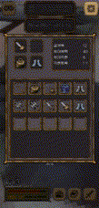

## 목표/조건
<li>GPS에 있어서, 상용 API를 사용하지 않을 것.</li>
<li>만들고자 하는 기능은 직접 구현할 것.</li>
<li>상용 앱처럼, 최대한 구동과 비주얼이 자연스럽도록 할 것.</li>

---

<br><br>

## 루프
<p align="center">
  
</p>
<p align="center"></p>

### 매니저 ([Managers 링크](https://github.com/HomebodyDevil/INUniversity/tree/master/Capstone/Assets/Scripts/Managers))
> 싱글톤 패턴으로 Player, Sound, Card, Equipment, Spec 등의 매니저를 사용합니다.

### 이벤트
> `Action` 대리자를 사용하여 전투 승리, 패배, 레벨 업 등의 이벤트를 관찰하고, 적절한 로직을 수행합니다.

---
<br><br>
## 데이터 관리 & 구조
<div aligh="center">
<table>
	<tr>
		<th>데이터 저장/불러오기, 로그인</th>
	</tr>
	<tr>
		<td>
			<p align="center"></p>
		</td>
	</tr>
	<tr>
		<td>
			<li>Unity Cloud를 사용.</li>
			<li><a href="https://github.com/HomebodyDevil/INUniversity/blob/master/Capstone/Assets/Scripts/Data/CloudData.cs">CloudData.cs(로그인)</a></li>
			<li><a href="https://github.com/HomebodyDevil/INUniversity/blob/master/Capstone/Assets/Scripts/Data/DataManager.cs">DataManager.cs(클라우드 저장/불러오기)</a></li>
		</td>
	</tr>
</table> 
</div>

---
<br><br>
## GPS
<div align="center">
<table>
  <tr>
    <th>그림</th>
    <th>영상</th>
  </tr>
  <tr>
    <td></td>
    <td></td>
  </tr>
</table>
</div>

> 사용자가 중심점으로부터 일정 거리 안(Area)에 들어오면, 게임 내 위치로 변환됩니다.<br>
> 하버사인 공식을 사용해 기준점과 사용자의 경도/위도 차이를 계산하여 x, y 위치로 변환합니다.

**의사코드 ([GPSManager.cs > getGPSCoroutine](https://github.com/HomebodyDevil/INUniversity/blob/master/Capstone/Assets/Scripts/Managers/GPSManager.cs))**
```pseudo
거리 = 하버사인(중심점, 사용자 위치)
if (거리 <= 반지름) {
    a = 하버사인(기준점.경도, 사용자.경도)
    b = 하버사인(기준점.위도, 사용자.위도)
    사용자 위치 = (a, b)
}
```

---
<br><br>
## 2.5D 시점 구현
<div align="center">
  <table style="width:90%; table-layout:fixed;">
    <tr>
      <th>그림</th>
      <th>영상</th>
    </tr>
    <tr>
      <td style="text-align:center;"></td>
      <td style="text-align:center;"></td>
    </tr>
  </table>
</div>

> 카메라와 캐릭터가 바라보는 벡터 간 각도를 구하여, 방향에 맞는 스프라이트로 애니메이션을 전환합니다.

**의사코드 ([PlayerSprite.cs > CalcAngleWithCamera](https://github.com/HomebodyDevil/INUniversity/blob/master/Capstone/Assets/Scripts/Player/PlayerSprite.cs))**
```pseudo
v1 = 캐릭터 위치 - 카메라 위치
angle = Quaternion(평면상에서 v1과 v2의 각도)
animator.SetFloat("angle", angle)
```

---
<br><br>
## 그 외
<div aligh="center">
	<table>
		<tr>
			<th style="30%">전투</th>
			<th style="50%">아이템, 장비, 카드( 사용, 관리 및 UI )</th>
			<th style="20%">적(객체) - 소환 및 관리</th>
		</tr>
		<tr>
			<td align="center"></td>
			<td align="center">&nbsp;&nbsp;</td>
			<td align="center"></td>
		</tr>
		<tr>
			<td align="center"><a href="https://github.com/HomebodyDevil/INUniversity/blob/master/Capstone/Assets/Scripts/Managers/BattleManager.cs">BattleManager<a>와 <a href="https://github.com/HomebodyDevil/INUniversity/blob/master/Capstone/Assets/Scripts/Managers/PlayerSpecManager.cs">PlayerSpecManager</a>, <a href="https://github.com/HomebodyDevil/INUniversity/blob/master/Capstone/Assets/Scripts/Managers/PlayerCardManager.cs">CardManager</a>가 연계됩니다.</td>
			<td align="center">각 객체들은 ScriptableObject를 기반으로 사용되며, 소유중인 것( 장비 / 아이템 / 카드)은 Player(<a href="https://github.com/HomebodyDevil/INUniversity/blob/master/Capstone/Assets/Scripts/Managers/PlayerEquipmentManager.cs">장비</a> / <a href="https://github.com/HomebodyDevil/INUniversity/blob/master/Capstone/Assets/Scripts/Managers/PlayerItemsManager.cs">아이템</a> / <a href="https://github.com/HomebodyDevil/INUniversity/blob/master/Capstone/Assets/Scripts/Managers/PlayerCardManager.cs">카드</a>)Manager에서 List로 관리합니다.</td>
			<td align="center">적 객체들은 ScriptableObject를 기반으로 사용되며, 임의의 영역에 스폰 확률에 따라 생성되도록 구현했습니다.(<a href="https://github.com/HomebodyDevil/INUniversity/blob/master/Capstone/Assets/Scripts/EnemySpawner.cs#L156">스포너</a>(SpawnEnemy)를 사용합니다.)</td>
		</tr>
	</table>
</div>
