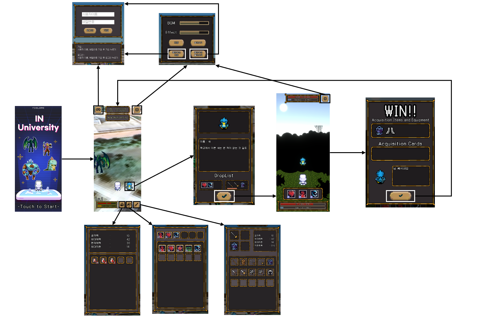

## 루프

	

## GPS

	

사용자가 중점으로부터 일정 거리 안(Area)에 들어왔다면, 사용자의 위치를 게임 상에 적용시킨다.
지정된 해당 Area의 기준점으로부터 가로(a), 세로(b)의 거리를 하버사인 공식을 사용하여 구한다.

Area의 기준점은 게임 상에서 (0, 0)이도록 했기 때문에, a를 x축에 대한 거리, b를 y축에 대한 거리로 적용한다.
